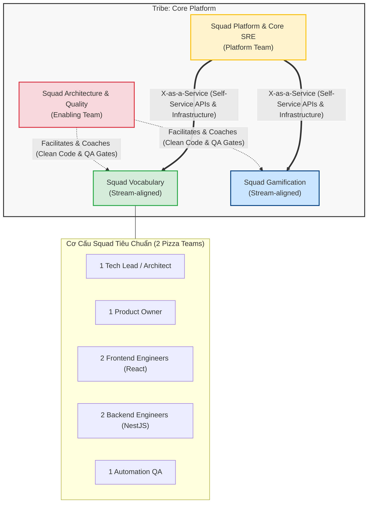
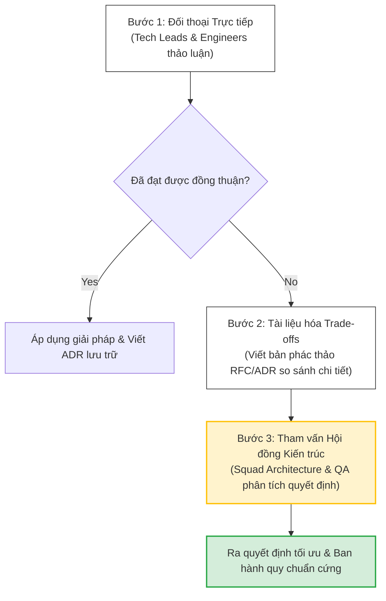

# 🚀 Welcome & Team Topologies Guide

Chào mừng bạn gia nhập đội ngũ kỹ sư của **Spark-Nexus-Ed** (stylized: `SparkNestEd` / `@spark-nest-ed`). 

Cuốn sổ tay này là tài liệu nhập môn chính thức giúp bạn nhanh chóng nắm bắt cấu trúc tổ chức, mô hình vận hành và các nguyên tắc giao tiếp giữa các đội ngũ kỹ thuật trong dự án. Chúng tôi tin rằng một cấu trúc nhóm rõ ràng, giảm thiểu tối đa ma sát giao tiếp và tối ưu hóa luồng phân phối giá trị là nền tảng cốt lõi để xây dựng hệ thống phần mềm trường tồn.

---

## 1. Tầm Nhìn Tổ Chức & Cấu Trúc Khối (Tribe & Squad Blueprint)

Phòng Công nghệ của **Spark-Nexus-Ed** vận hành theo sự kết hợp chặt chẽ giữa mô hình tổ chức tự chủ của **Spotify** và triết lý phân rã nhóm của **Team Topologies**. Chúng tôi chia nhỏ nhân lực thành các nhóm chức năng chéo (**Cross-functional & Autonomous**) có ranh giới nghiệp vụ rõ ràng để giảm tối đa tải nhận thức (**cognitive load**) cho mỗi kỹ sư.

### 📊 Sơ Đồ Cấu Trúc Tổng Quan (Organizational Schema)



### 🧱 4 Loại Nhóm (Team Types) Theo Team Topologies

1.  **Stream-aligned Team (Nhóm theo luồng giá trị)**: Là các nhóm tập trung liên tục vào một luồng nghiệp vụ kinh doanh cốt lõi từ đầu đến cuối. Họ có khả năng tự chủ cực cao để phân phối tính năng mà không bị phụ thuộc vào các nhóm khác.
2.  **Platform Team (Nhóm nền tảng)**: Cung cấp hạ tầng tự phục vụ (Self-service Platform) giúp các nhóm Stream-aligned phát triển nhanh hơn mà không cần hiểu sâu cấu trúc Kubernetes hay quản trị mạng bên dưới.
3.  **Enabling Team (Nhóm hỗ trợ)**: Nghiên cứu, huấn luyện và chuyển giao công nghệ mới hoặc các tiêu chuẩn chất lượng, giúp các nhóm khác vượt qua các điểm nghẽn về năng lực kỹ thuật.
4.  **Complicated-Subsystem Team (Nhóm phân hệ phức tạp)**: (Nếu có) Tập trung vào một phần hệ thống đòi hỏi kiến thức chuyên môn cực sâu như tối ưu hóa công cụ AI xử lý ngôn ngữ tự nhiên. Hiện tại, phần này được tích hợp trực tiếp vào Squad Vocabulary dưới dạng module chuyên biệt.

---

## 2. Chi Tiết Các Nhóm Kỹ Thuật (Team Roles & Responsibilities)

### 2.1. Stream-aligned Teams (Squads Nghiệp Vụ)

#### A. Squad Vocabulary (Học tập & Biên tập Từ vựng)
*   **Phạm vi nghiệp vụ**: Quản lý toàn bộ vòng đời của gói từ vựng (`Vocabulary Set`), cơ sở dữ liệu từ điển hệ thống (`Entry`), và tiến trình học tập cá nhân hóa (`User Progress`).
*   **Mục tiêu cốt lõi**:
    *   Cung cấp trải nghiệm biên tập từ vựng (Word Editor Layout) mượt mà bậc nhất, tích hợp Debounced Auto-Save.
    *   Triển khai thuật toán ôn tập ngắt quãng (Spaced Repetition System - SRS) với độ chính xác cao nhất dựa trên thuật toán SM2 (SuperMemo-2).
*   **Thành phần nhóm**: 1 Tech Lead, 1 Product Owner, 2 Frontend Devs, 2 Backend Devs, 1 QA.

#### B. Squad Gamification & Motivation (Động lực học tập)
*   **Phạm vi nghiệp vụ**: Vận hành các cơ chế kích thích học tập như điểm thưởng (`EXP`), bảng xếp hạng (`Leaderboard`), hệ thống thành tựu (`Achievements`), và các mini-games tương tác.
*   **Mục tiêu cốt lõi**: Tăng tỷ lệ giữ chân người dùng (Retention Rate) và kích thích tương tác hàng ngày thông qua các cơ chế phần thưởng thời gian thực (Real-time updates).

---

### 2.2. Platform Team (Đội Ngũ Nền Tảng)

*   **Tên nhóm**: **Squad Platform & Core SRE**
*   **Phạm vi hoạt động**: Phát triển hạ tầng tự phục vụ bao gồm hệ thống CI/CD pipelines, hạ tầng Kubernetes/Docker, cơ chế phân bổ Redis Cache, logging tập trung (Elastic/Kibana), và quản trị bảo mật (Doppler/Vault).
*   **Mục tiêu cốt lõi**: Đảm bảo các Squads nghiệp vụ có thể tự triển khai và giám sát dịch vụ của họ mà không cần phụ thuộc hay yêu cầu thủ công từ đội ngũ Platform.

---

### 2.3. Enabling Team (Nhóm Hỗ Trợ Kỹ Thuật)

*   **Tên nhóm**: **Squad Architecture & Quality Assurance**
*   **Phạm vi hoạt động**: Nghiên cứu công nghệ mới, thiết lập và duy trì các luật lệ code thép (**Clean Code Laws**), xây dựng thư viện dùng chung chính thức (`@spark-nest-ed/shared-libs`), và hỗ trợ đào tạo chuyên môn cho các Squads nghiệp vụ.
*   **Mục tiêu cốt lõi**: Nâng cao năng lực kỹ thuật của toàn bộ phòng công nghệ và giảm thiểu nợ kỹ thuật (Technical Debt).

---

## 3. Quy Tắc Giao Tiếp Giữa Các Nhóm (Interaction Framework)

Để tránh tình trạng chồng chéo quyền hạn và tắc nghẽn tiến độ phân phối, chúng tôi quy chuẩn hóa 3 chế độ tương tác chính:

| Chế độ tương tác | Mô tả chi tiết | Quy tắc áp dụng thực tế |
| :--- | :--- | :--- |
| **API-First (X-as-a-Service)** | Một nhóm cung cấp sản phẩm/dịch vụ của họ thông qua các API, tài liệu rõ ràng để nhóm khác tự tiêu thụ mà không cần hỏi han. | Áp dụng tuyệt đối cho giao tiếp giữa **Squad Platform** và các **Squads nghiệp vụ**. Ví dụ: Cung cấp API ghi log, cổng kết nối Cache Redis, hoặc gửi Event. |
| **Collaboration (Cùng hợp tác)** | Hai nhóm cùng bắt tay làm việc chung trong một thời gian ngắn (tối đa 2 tuần) để giải quyết một điểm nghẽn tích hợp phức tạp. | Áp dụng khi **Squad Vocabulary** và **Squad Gamification** thiết lập luồng tích hợp cộng điểm EXP khi học xong một bộ từ vựng mới. |
| **Facilitation (Hỗ trợ chuyên môn)** | Một nhóm có chuyên môn cao tiến hành huấn luyện, gỡ lỗi hoặc chuyển giao công nghệ cho nhóm khác. | Áp dụng khi **Squad Architecture** hỗ trợ nâng cấp coverage test cho một Squad nghiệp vụ đang bị kẹt ở Quality Gate. |

### 💻 Minh Họa API-First Contract Thực Tế

Khi một người dùng hoàn thành một lượt ôn tập từ vựng, Squad Vocabulary sẽ phát ra một sự kiện (Event) qua hệ thống Message Queue (BullMQ) để thông báo cho Squad Gamification thực hiện cộng điểm EXP và cập nhật bảng xếp hạng. 

Hợp đồng dữ liệu (API Contract) này được định nghĩa chặt chẽ trong thư viện dùng chung `@spark-nest-ed/shared-libs` để cả hai đội tuân thủ tuyệt đối:

```typescript
// @spark-nest-ed/shared-libs/src/contracts/events/vocabulary-learned.event.ts

/**
 * Interface định nghĩa dữ liệu của sự kiện khi một từ vựng được học xong.
 * Đây là API Contract chính thức giữa Squad Vocabulary (Publisher) và Squad Gamification (Subscriber).
 */
export interface IVocabularyLearnedEvent {
  eventId: string;        // UUID định danh sự kiện độc bản
  userId: string;         // UUID người dùng
  wordEntryId: string;    // ID từ vựng đã học
  sessionType: 'SRS' | 'FLASHCARD' | 'GAME'; // Hình thức học
  score: number;          // Điểm số đạt được trong lượt học (0 - 100)
  timestamp: string;      // Định dạng ISO UTC (ví dụ: '2026-05-24T06:00:00Z')
}

export const VOCABULARY_LEARNED_QUEUE = 'vocabulary-learned-queue';
export const VOCABULARY_LEARNED_EVENT_NAME = 'vocabulary.learned';
```

Mã nguồn xử lý sự kiện phía **Squad Gamification** (Subscriber) tuân thủ hoàn hảo contract đã ký:

```typescript
// apps/api-sne/src/modules/gamification/consumers/vocabulary-learned.consumer.ts
import { Processor, Process } from '@nestjs/bull';
import { Injectable, Logger } from '@nestjs/common';
import { Job } from 'bull';
import { 
  IVocabularyLearnedEvent, 
  VOCABULARY_LEARNED_QUEUE, 
  VOCABULARY_LEARNED_EVENT_NAME 
} from '@spark-nest-ed/shared-libs';

@Injectable()
@Processor(VOCABULARY_LEARNED_QUEUE)
export class VocabularyLearnedConsumer {
  private readonly logger = new Logger(VocabularyLearnedConsumer.name);

  @Process(VOCABULARY_LEARNED_EVENT_NAME)
  async handleVocabularyLearned(job: Job<IVocabularyLearnedEvent>) {
    const { eventId, userId, score, sessionType } = job.data;
    
    this.logger.log(`[Event Received] Processing event: ${eventId} for user: ${userId}`);

    // Tính toán số lượng EXP nhận được dựa trên hình thức học và điểm số
    let baseExp = 10;
    if (sessionType === 'SRS') baseExp = 20; // Ôn tập ngắt quãng được nhiều EXP hơn
    
    const earnedExp = Math.round(baseExp * (score / 100));

    if (earnedExp <= 0) {
      this.logger.warn(`[Gamification] Score ${score} too low. No EXP rewarded to User: ${userId}`);
      return;
    }

    // Thực hiện cộng điểm EXP thông qua Transaction Database
    await this.rewardUserExp(userId, earnedExp, eventId);
  }

  private async rewardUserExp(userId: string, exp: number, sourceEventId: string): Promise<void> {
    // Logic cập nhật EXP cho user và ghi nhận lịch sử giao dịch (Transaction Logs)
    this.logger.log(`[Gamification] Successfully rewarded ${exp} EXP to user ${userId} from event ${sourceEventId}`);
  }
}
```

---

## 4. Quản Lý Tải Nhận Thức (Cognitive Load Management)

Tải nhận thức của kỹ sư được định nghĩa là lượng tài nguyên trí tuệ cần thiết để thực hiện công việc. Nếu một kỹ sư phải hiểu toàn bộ hệ thống từ DevOps đến thuật toán AI cùng một lúc, họ sẽ bị quá tải, dẫn đến giảm chất lượng code và kiệt sức.

Chúng tôi áp dụng các cơ chế sau để bảo vệ tải nhận thức của kỹ sư:

1.  **Quy mô nhóm tối ưu (2 Pizza Teams)**: Mỗi Squad giới hạn từ **5 đến 9 thành viên**. Nếu một nhóm vượt quá 9 người, nó bắt buộc phải được tách ra thành 2 nhóm nhỏ hơn có ranh giới nghiệp vụ riêng biệt.
2.  **Phân rã luồng thông tin**:
    *   **Kênh Slack**: Mỗi Squad có một kênh riêng biệt cho thảo luận nội bộ (ví dụ: `#squad-vocab-internal`) và một kênh hỗ trợ cộng đồng (`#squad-vocab-support`). Tránh nhồi nhét tất cả các kỹ sư vào một kênh chat chung duy nhất.
    *   **Jira Boards**: Mỗi nhóm có một Sprint Board riêng biệt. Bạn chỉ cần tập trung vào các Tickets thuộc phạm vi Sprint của nhóm mình.
3.  **Tách biệt Monorepo**: Toàn bộ mã nguồn được tổ chức trong cấu trúc thư mục Nx chặt chẽ:
    *   `apps/` chỉ chứa mã nguồn bootstrap ứng dụng.
    *   `libs/` chứa mã nguồn thực tế và được phân tách theo miền nghiệp vụ. Bạn chỉ cần mở các thư mục liên quan trực tiếp đến nhiệm vụ của mình.

---

## 5. Quy Trình Giải Quyết Tranh Chấp Kiến Trúc (Architecture Dispute Resolution Flow)

Khi hai nhóm có ý kiến trái chiều về thiết kế API Contract, cấu trúc dữ liệu cơ sở dữ liệu chung hoặc ranh giới phân định aggregate, họ bắt buộc phải tuân theo quy trình giải quyết văn minh gồm 3 bước dưới đây để tránh bế tắc dự án:



1.  **Bước 1: Đối thoại Trực tiếp**: Tech Leads của hai nhóm tổ chức một buổi họp kỹ thuật ngắn (tối đa 30 phút), phân tích trên tinh thần xây dựng và tập trung vào lợi ích hệ thống thay vì cái tôi cá nhân.
2.  **Bước 2: Tài liệu hóa Trade-offs (RFC/ADR Draft)**: Nếu bước 1 bế tắc, hai bên cùng soạn thảo một tài liệu so sánh chi tiết. Phân tích cụ thể các ưu/nhược điểm, chi phí phát triển, hiệu năng runtime và bảo trì của từng phương án kiến trúc đề xuất.
3.  **Bước 3: Tham vấn Hội đồng Kiến trúc**: Gửi tài liệu so sánh lên **Squad Architecture & QA**. Hội đồng sẽ tổ chức buổi họp phản biện, đưa ra quyết định cuối cùng dựa trên các chỉ số kỹ thuật khách quan và các quy luật kỹ thuật của dự án. Quyết định này sẽ được lưu trữ chính thức tại thư mục `docs/adr/`.

---

## 6. Luật Thép API-First & Ranh Giới Database

> [!IMPORTANT]
> Toàn bộ đội ngũ phát triển phải ghi nhớ 3 luật thép sau trong hoạt động hàng ngày:
> 
> 1. **Tuyệt đối cấm truy cập trực tiếp Database chéo**: Squad Vocabulary không được phép viết câu lệnh SQL/Prisma join bảng của Squad Gamification. Mọi hoạt động lấy dữ liệu chéo bắt buộc phải thông qua Endpoint API (HTTP REST/gRPC) hoặc Event Queue đã được xuất bản chính thức.
> 2. **Duy trì Backward Compatibility**: Khi cập nhật API, bắt buộc phải duy trì tính tương thích ngược (v1, v2) tối thiểu **6 tháng** để các nhóm khác có thời gian chuyển đổi. Tuyệt đối cấm deploy code gây sập (breaking change) hệ thống của nhóm khác trên môi trường Production.
> 3. **Contracts Validation**: Mọi đặc tả API giữa các nhóm phải được thiết kế và phê duyệt thông qua tài liệu [API Design Standards](../05-backend-architecture-standards/02-api-design-rest-graphql-grpc.md) trước khi bắt tay viết code.
