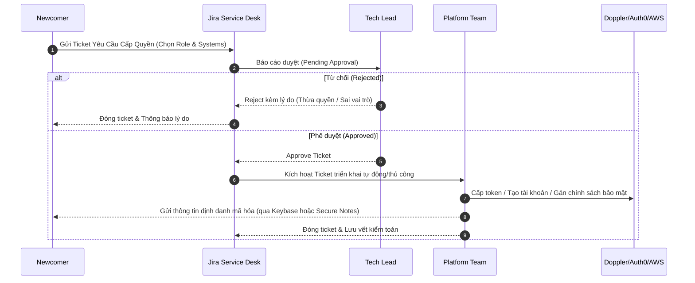
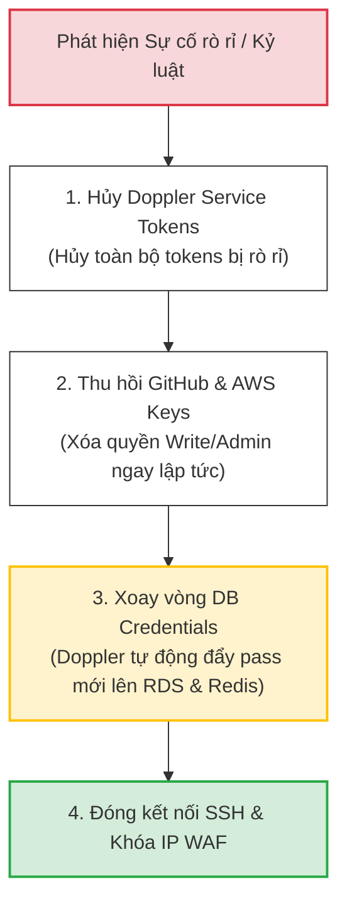

# 🔐 Access Provisioning Matrix & Security Governance

Tài liệu này đặc tả **Ma trận phân bổ quyền hạn tối thiểu (Least Privilege Access Control Matrix)** dành cho toàn bộ nhân sự kỹ thuật tại dự án **Spark-Nexus-Ed**. Quy trình cấp quyền tuân thủ các chuẩn mực an toàn thông tin ISO 27001 và SOC2, đảm bảo tính minh bạch, khả năng kiểm toán (Audit Trail) và bảo mật tuyệt đối cho mọi tài nguyên hệ thống.

---

## 1. Ma Trận Phân Quyền Hạt Mịn (Access Control Matrix)

Chúng tôi phân loại quyền hạn dựa trên vai trò công việc (**Role-Based Access Control - RBAC**) và áp dụng nguyên tắc đặc quyền tối thiểu: *Chỉ cấp đúng và đủ quyền hạn cần thiết để hoàn thành công việc.*

| Hệ Thống / Tài Khoản | Intern Engineer | Software Engineer | Tech Lead / Architect | Platform / SRE |
| :--- | :--- | :--- | :--- | :--- |
| **GitHub Organization** | **Read-Only**<br/>Xem mã nguồn, tạo nhánh từ feature branch, mở Pull Requests. Không được trực tiếp merge. | **Write**<br/>Tạo nhánh feature/bugfix, merge PR vào `develop` sau khi vượt qua Quality Gates & được Tech Lead phê duyệt. | **Admin**<br/>Cấu hình Branch Protection, phê duyệt PRs đặc biệt, merge vào `master` / `main`. | **Owner**<br/>Quản trị tổ chức, cấu hình Webhooks, quản lý GitHub Actions Secrets toàn cục. |
| **Jira / Confluence** | **Member**<br/>Tạo/cập nhật tickets của bản thân, xem và đóng góp tài liệu kỹ thuật trên Wiki. | **Member**<br/>Tự quản lý Sprint backlog cá nhân, viết Wiki thiết kế chi tiết (technical design documents). | **Project Lead**<br/>Quản trị Sprint, phân bổ công việc, định cấu hình bảng Kanban/Scrum và quy trình workflow. | **Administrator**<br/>Cấu hình nâng cao, quản lý phân quyền Jira, tích hợp GitHub và Doppler Plugins. |
| **AWS Cloud (Console/CLI)** | **None**<br/>Tuyệt đối không có quyền truy cập môi trường AWS Cloud. | **ReadOnly (Dev Env)**<br/>Xem log CloudWatch, kiểm tra trạng thái RDS và container trên AWS ECS môi trường Dev. | **Read/Write (Dev/Stg)**<br/>Đọc/ghi tài nguyên Dev/Staging. Cấp quyền can thiệp khẩn cấp (Emergency Access) trong sprint. | **Administrator**<br/>Toàn quyền quản trị IAM, mạng VPC, cấu hình RDS Cluster và hạ tầng Kubernetes thông qua Terraform IaC. |
| **Doppler (Secrets)** | **Developer (Dev Config)**<br/>Đọc secrets môi trường Dev để chạy máy local qua Doppler CLI. | **Developer (Dev/Stg)**<br/>Đọc secrets môi trường Dev và Staging để phục vụ debug và kiểm thử liên kết. | **Architect (Dev/Stg/UAT)**<br/>Quản lý, chỉnh sửa biến cấu hình của môi trường Dev, Staging, UAT. Xem Read-only Prod. | **Owner / Admin**<br/>Quản trị tối cao Doppler, tạo dự án, phân phối Service Tokens cho CI/CD và runtime containers. |
| **Auth0 Tenant** | **None**<br/>Không có quyền truy cập Auth0 Dashboard. | **Viewer (Dev/Stg)**<br/>Xem danh sách cấu hình Clients, kiểm tra logs đăng nhập của người dùng môi trường thử nghiệm. | **Admin (Dev/Stg)**<br/>Cấu hình JWT Token Lifetime, Social Login, Webhooks cho môi trường Dev & Staging. | **System Owner**<br/>Quản trị Tenant Production, cấu hình chứng chỉ ký JWKS, thiết lập MFA và quy tắc bảo mật login. |
| **SonarQube Platform** | **Viewer**<br/>Xem báo cáo lỗi tĩnh (Static Code Analysis) và độ bao phủ kiểm thử (test coverage) của PR. | **Viewer**<br/>Xem báo cáo lỗi tĩnh, độ bao phủ coverage của PR. Yêu cầu sửa lỗi bảo mật (security hotspots). | **Project Admin**<br/>Cấu hình ngưỡng Quality Gate, phê duyệt ngoại lệ (false-positives) cho mã nguồn. | **System Admin**<br/>Quản trị máy chủ SonarQube, nâng cấp plugins kiểm thử tĩnh và tích hợp GitHub CI. |

---

## 2. Chính Sách Xác Thực Đa Nhân Tố (MFA & Device Security Policy)

Để bảo vệ các cổng truy cập nhạy cảm, mọi kỹ sư bắt buộc phải tuân thủ chính sách bảo mật thiết bị và xác thực sau:

1.  **Bắt buộc kích hoạt MFA (Multi-Factor Authentication)**:
    *   MFA dạng **TOTP** (qua Google Authenticator, Authy, hoặc 1Password) hoặc **Hardware Security Key** (YubiKey) là bắt buộc 100% đối với: *GitHub, AWS Console, Doppler Account, Auth0 Dashboard, và Google Workspace*.
    *   Tuyệt đối cấm sử dụng MFA qua SMS (do rủi ro bị tấn công SIM-swapping).
2.  **Tiêu chuẩn bảo mật Workstation cá nhân**:
    *   Máy tính cá nhân làm việc bắt buộc phải bật tính năng mã hóa ổ cứng toàn phần (**BitLocker** trên Windows hoặc **FileVault** trên macOS).
    *   Thiết lập mật khẩu máy tính tối thiểu 12 ký tự, tự động khóa màn hình sau **5 phút** không hoạt động.
    *   Cài đặt và duy trì phần mềm quét mã độc được công ty phê chuẩn.

---

## 3. Quy Trình Cấp Quyền Đăng Ký (Access Request Lifecycle)

Môi trường phát triển của chúng tôi tuyệt đối không tồn tại việc cấp quyền thủ công qua chat hoặc nói miệng. Mọi yêu cầu cấp quyền đều phải để lại dấu vết kiểm toán (**Audit Trail**):



### 📋 Biểu Mẫu Gửi Yêu Cầu Cấp Quyền (Jira Template)

Khi gửi ticket trên Jira Service Desk, bạn bắt buộc phải điền đầy đủ thông tin theo biểu mẫu chuẩn sau:

```markdown
### YÊU CẦU CẤP QUYỀN TRUY CẬP HỆ THỐNG
* **Tiêu đề**: [ACCESS-REQUEST] Cấp quyền môi trường cho kỹ sư mới - [Họ và Tên]
* **Vai trò**: Software Engineer / Intern / Tech Lead / SRE
* **Squad trực thuộc**: Squad Vocabulary / Squad Gamification / Squad Platform
* **Hệ thống yêu cầu**: GitHub (Write Access), Doppler (Dev/Staging), SonarQube (Viewer)
* **Lý do nghiệp vụ**: Thực hiện phát triển tính năng biên tập từ vựng và đồng bộ secrets local trong Sprint 12.
* **GPG Public Key (Mã khóa công khai)**: 
  -----BEGIN PGP PUBLIC KEY BLOCK-----
  Version: GnuPG v2
  [Mã khóa công khai GPG của bạn ở đây để Platform Team mã hóa thông tin tài khoản]
  -----END PGP PUBLIC KEY BLOCK-----
```

---

## 4. Quy Trình Thu Hồi Quyền Hạn (Access Revocation Flow)

### 4.1. Thu Hồi Tự Động (SSO/IDP Integration)
Chúng tôi tích hợp toàn bộ các hệ thống (Slack, Jira, AWS, GitHub) thông qua **Single Sign-On (SSO)** sử dụng giao thức SAML 2.0 kết nối trực tiếp về **Google Workspace IDP** trung tâm.
*   Khi một kỹ sư kết thúc hợp đồng hoặc chuyển đổi dự án, tài khoản IDP trung tâm bị khóa $\rightarrow$ **Toàn bộ quyền truy cập các hệ thống vệ tinh tự động bị hủy kích hoạt ngay lập tức trong vòng 60 giây**.

### 4.2. Thu Hồi Khẩn Cấp (Emergency Incident Response)
Khi phát hiện dấu hiệu rò rỉ token (leak secret) hoặc kỹ sư có hành vi cố ý xâm phạm mã nguồn, SRE Team sẽ kích hoạt quy trình thu hồi khẩn cấp:



1.  **Hủy Doppler Tokens**: SRE lập tức kích hoạt lệnh thu hồi trên Doppler Dashboard để vô hiệu hóa các Service Tokens và Personal Access Tokens bị nghi ngờ rò rỉ.
2.  **Khóa GitHub & AWS IAM**: Xóa tài khoản khỏi GitHub Organization hoặc hạ cấp về Read-Only; vô hiệu hóa các Access Keys và SSH Keys trên AWS IAM.
3.  **Xoay vòng thông tin bảo mật (Rotate Database Credentials)**:
    *   Doppler kích hoạt webhook tự động yêu cầu AWS RDS PostgreSQL cập nhật mật khẩu cơ sở dữ liệu mới.
    *   Doppler đẩy các giá trị mật khẩu mới này đến các container runtime của NestJS và khởi động lại dịch vụ dạng rolling-restart để áp dụng cấu hình bảo mật mới không gây gián đoạn hệ thống.

---

## 5. Rà Soát Quyền Hạn Định Kỳ (Quarterly Access Review - QAR)

Để ngăn ngừa tình trạng tích tụ quyền hạn (Privilege Creep), SRE Team cùng các Tech Leads sẽ tổ chức rà soát quyền hạn định kỳ vào tuần cuối cùng của mỗi Quý:

1.  **Thu thập dữ liệu**: Xuất danh sách phân quyền thực tế từ GitHub, AWS IAM, Doppler và Auth0.
2.  **Đối chiếu & Loại bỏ**:
    *   Đối chiếu danh sách tài khoản đang active với danh sách nhân sự thực tế từ phòng Nhân sự.
    *   Tự động khóa các tài khoản không có hoạt động đăng nhập (Inactive) trong vòng **30 ngày**.
    *   Hạ cấp hoặc thu hồi các quyền truy cập Staging/Production của các kỹ sư đã chuyển đổi dự án hoặc không còn nhu cầu nghiệp vụ thực tế.
3.  **Lưu trữ biên bản**: Báo cáo rà soát quyền hạn được ký duyệt điện tử và lưu trữ trên Confluence nhằm phục vụ cho hoạt động đánh giá tuân thủ an toàn thông tin hàng năm (SOC2 Audit).
