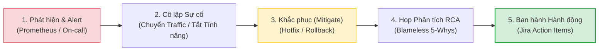

# 🤝 Engineering Values & Ethics (Văn Hóa & Đạo Đức Kỹ Thuật)

Dự án **Spark-Nexus-Ed** không chỉ được định hình bởi những dòng code sạch, thuật toán tối ưu hay kiến trúc hiện đại, mà trên hết là bởi **Văn hóa Kỹ thuật lành mạnh** và **Đạo đức nghề nghiệp không thỏa hiệp** của toàn bộ đội ngũ kỹ sư. 

Tài liệu này quy định các hành vi chuẩn mực, văn hóa đánh giá mã nguồn (Code Review), đạo đức quản trị dữ liệu người dùng và những nguyên tắc đạo đức nghề nghiệp bắt buộc mọi kỹ sư phải tuân thủ nghiêm ngặt trong hoạt động hàng ngày.

---

## 1. Văn Hóa Review Code Chuẩn Mực (Code Review Principles)

Code Review là quá trình học tập lẫn nhau, chia sẻ tri thức và bảo vệ chất lượng hệ thống, tuyệt đối không phải là nơi thể hiện cái tôi cá nhân, lên lớp hay chỉ trích đồng nghiệp.

### ⚖️ Các Nguyên Tắc Vàng Khi Review Code:
1.  **Nhận xét mã nguồn, không nhận xét con người**:
    *   *Sai*: *"Tại sao bạn lại viết một đoạn code ngớ ngẩn và phức tạp như thế này?"*
    *   *Đúng*: *"Đoạn code chạy vòng lặp lồng nhau ở dòng 45 có thể gặp vấn đề về hiệu năng O(N^2) khi danh sách từ vựng tăng lên trên 1000 phần tử. Chúng ta có thể cân nhắc chuyển sang sử dụng cấu trúc Map để tối ưu thời gian tìm kiếm về O(1) được không?"*
2.  **Luôn giải thích lý do "Why" khi yêu cầu thay đổi (Request Changes)**:
    *   Nếu bạn đề nghị sửa đổi bất kỳ dòng code nào, bạn bắt buộc phải giải thích rõ ràng cơ sở khoa học (vấn đề hiệu năng, bảo mật, vi phạm Clean Code Law) và đưa ra giải pháp gợi ý cụ thể.
3.  **Thái độ cởi mở và lắng nghe**:
    *   Khi nhận được ý kiến đóng góp, hãy trân trọng và phân tích khách quan các điểm đánh đổi (trade-offs) thay vì tìm cách phòng thủ hoặc bao biện cho các lỗi rõ ràng.

### 💬 Quy Chuẩn Conventional Comments Trong Pull Requests

Để tránh các hiểu lầm không đáng có về giọng điệu chat và giúp tác giả PR phân loại nhanh mức độ quan trọng của các ý kiến đóng góp, toàn bộ kỹ sư bắt buộc phải áp dụng chuẩn **Conventional Comments** khi review mã nguồn:

| Nhãn Comment | Ý Nghĩa Kỹ Thuật | Ví Dụ Thực Tế |
| :--- | :--- | :--- |
| **`[blocking]`** | **Bắt buộc phải sửa**. Lỗi logic nghiêm trọng, hổng bảo mật, thiếu tests hoặc vi phạm nghiêm trọng Clean Code Laws cứng. Không được phép merge PR nếu chưa giải quyết. | *`[blocking] Dòng 82 đang in mật khẩu người dùng ở dạng plain text ra log. Hãy bọc qua Winston Masking Engine ngay.`* |
| **`[suggestion]`** | **Khuyến nghị cải tiến**. Đề xuất giải pháp viết code tối ưu hơn, dễ đọc hơn hoặc cấu trúc tốt hơn nhưng không bắt buộc phải sửa trong PR này. | *`[suggestion] Bạn có thể bọc logic tính toán chu kỳ SM2 này vào một helper function riêng để dễ dàng viết unit test độc lập.`* |
| **`[nitpick]`** | **Ý kiến vụn vặt**. Các lỗi nhỏ nhặt về style guide, khoảng trắng thừa, hoặc lỗi chính tả (typo) trong comment. Tác giả có thể sửa hoặc bỏ qua nếu vội. | *`[nitpick] Sai chính tả tiếng Anh ở comment dòng 12: 'recieved' -> 'received'.`* |
| **`[question]`** | **Đặt câu hỏi tìm hiểu**. Người review muốn làm rõ mục đích thiết kế của một đoạn code lạ mà không có ý định bắt bẻ. | *`[question] Mình thấy bạn gọi prisma.$queryRaw ở đây thay vì dùng Prisma Client thông thường. Có lý do đặc biệt nào về mặt hiệu năng không?`* |
| **`[praise]`** | **Khen ngợi**. Ghi nhận một giải pháp thông minh, viết code đẹp, cấu trúc tinh gọn hoặc viết tests xuất sắc của đồng nghiệp. | *`[praise] Khúc xử lý Cleanups cho Event Stream bằng RxJS ở đây viết cực kỳ mượt và sạch. Rất đáng học tập!`* |

---

## 2. Đạo Đức Bảo Vệ Dữ Liệu & Quyền Riêng Tư (Data Ethics & PII)

Chúng tôi phục vụ hàng triệu người dùng học tập, việc bảo mật dữ liệu cá nhân là trách nhiệm đạo đức cao nhất của kỹ sư. Bạn bắt buộc phải tuân thủ chính sách **PII (Personally Identifiable Information)** sau:

1.  **Tuyệt đối cấm ghi thông tin PII thô ra Logs**:
    *   Thông tin PII bao gồm: *Họ tên, Email, Số điện thoại, Mật khẩu, Địa chỉ, và JWT tokens*.
    *   Mọi thông tin này khi ghi log bắt buộc phải được mã hóa hoặc ẩn đi (Masking) thông qua Winston Logging Engine (ví dụ: `nguyenvan@gmail.com` $\rightarrow$ `n***n@gmail.com`).
2.  **Quy định về Dữ liệu Môi trường Thử nghiệm**:
    *   **Nghiêm cấm tuyệt đối** việc sao chép (backup/clone) cơ sở dữ liệu thật của người dùng trên môi trường Production về máy trạm cục bộ (local) hoặc môi trường Dev/Staging để phục vụ test.
    *   Mọi dữ liệu kiểm thử bắt buộc phải được sinh ngẫu nhiên bằng công cụ tự động thông qua [Test Data Factory](../09-testing-quality-gates/02-test-data-factory-mocking.md).

---

## 3. Văn Hóa Ứng Phó Sự Cố Không Quy Tội (Blameless Post-Mortem Philosophy)

> [!IMPORTANT]
> Triết lý cốt lõi của chúng tôi là: **Con người không cố ý làm hỏng hệ thống**. 
> 
> Khi xảy ra sự cố sập hệ thống (Outage) trên Production, mục tiêu hàng đầu là bảo vệ dữ liệu người dùng và phục hồi dịch vụ sớm nhất, tuyệt đối không phải là tìm kiếm cá nhân để đổ lỗi hoặc phạt kỷ luật.

Chúng tôi vận hành quy trình ứng phó và tổng kết sự cố chuyên nghiệp qua 5 bước sau:

1.  **Bước 1: Phát hiện và Cảnh báo**: Khi Prometheus cảnh báo chỉ số lỗi tăng vọt, kỹ sư trực chiến (On-call Engineer) lập tức tạo kênh Slack sự cố (ví dụ: `#incident-2026-05-24`) để tập hợp lực lượng cứu hộ.
2.  **Bước 2: Cô lập Sự cố**: SRE Team phối hợp Tech Lead khoanh vùng lỗi, thực hiện hạ cấp tính năng (Graceful Degradation) hoặc ngắt kết nối các microservices bị lỗi để bảo vệ database chính.
3.  **Bước 3: Khắc phục (Mitigation)**: Thực hiện rollback nhanh phiên bản code cũ an toàn gần nhất, hoặc triển khai một bản vá nóng (Hotfix) đã được kiểm thử nhanh qua CI/CD.
4.  **Bước 4: Tổ chức họp phân tích nguyên nhân gốc rễ (RCA - Root Cause Analysis)**:
    *   Tổ chức cuộc họp Post-Mortem với sự tham gia của các bên liên quan trong vòng **48 giờ** sau sự cố.
    *   Áp dụng phương pháp **5 Whys** để truy vấn sâu xa vấn đề hệ thống (Ví dụ: Tại sao bug lọt qua test? Vì test data thiếu trường hợp này. Tại sao thiếu? Vì quy trình viết test chưa bao phủ luồng biên...).
5.  **Bước 5: Ban hành và Theo dõi Hành động Khắc phục (Action Items)**:
    *   Đăng ký các ticket sửa đổi hệ thống, bổ sung cảnh báo giám sát lên Jira.
    *   Toàn bộ biên bản Post-Mortem phải được công khai trên Confluence cho toàn phòng công nghệ học tập.

---

## 4. Giao Tiếp Bất Đồng Bộ & Lịch Họp Lành Mạnh (Async Comm & Meeting Hygiene)

### 4.1. Giao Tiếp Bất Đồng Bộ (Async Communication SLA)
Để bảo vệ trạng thái lập trình tập trung sâu (Deep Work) của kỹ sư, chúng tôi ưu tiên giao tiếp bất động bộ hơn là liên tục ngắt quãng đồng nghiệp bằng các cuộc gọi bất ngờ:

*   **SLA Đánh giá PR**: Mọi kỹ sư có nghĩa vụ rà soát và phản hồi PR của đồng nghiệp cùng Squad tối đa trong vòng **24 giờ làm việc**.
*   **Slack Thread SLA**: Trả lời các tin nhắn thảo luận nghiệp vụ không khẩn cấp trong vòng **2 giờ làm việc**. Hãy viết tin nhắn đầy đủ thông tin trong một block duy nhất thay vì gõ từng câu ngắn vụn vặt gây bắn thông báo liên tục.

### 4.2. Chính Sách "Silent Wednesdays" (Thứ Tư Im Lặng)
Chúng tôi thiết lập quy tắc **Silent Wednesdays** (Thứ Tư im lặng):
*   **Tuyệt đối không tổ chức bất kỳ cuộc họp định kỳ nào** (Daily standup, Sprint review, Tech talk) vào ngày Thứ Tư.
*   Đây là khoảng thời gian linh thiêng dành hoàn toàn cho kỹ sư tập trung gõ code sâu sắc, nghiên cứu thuật toán và tối ưu hệ thống mà không bị gián đoạn bởi các lịch họp chen ngang.

### 4.3. Tiêu Chuẩn Tổ Chức Họp (Meeting Hygiene)
Khi bắt buộc phải tạo cuộc họp, bạn phải tuân thủ 3 nguyên tắc:
1.  **No Agenda, No Meeting**: Mọi lời mời họp bắt buộc phải đính kèm Agenda (Nội dung thảo luận & Mục tiêu đạt được) gửi trước cuộc họp tối thiểu **2 giờ**. Người nhận có quyền từ chối tham gia nếu không có Agenda rõ ràng.
2.  **Đúng thành phần**: Chỉ mời những nhân sự liên quan trực tiếp đến việc ra quyết định. Rút ngắn thời gian họp tối đa (khuyến nghị **15 - 30 phút**).
3.  **Meeting Minutes**: Cuối buổi họp, người chủ trì phải ghi lại biên bản tóm tắt các quyết định đã thống nhất và phân công công việc (Action Items) kèm Deadline rõ ràng, gửi trực tiếp lên kênh Slack của nhóm.
