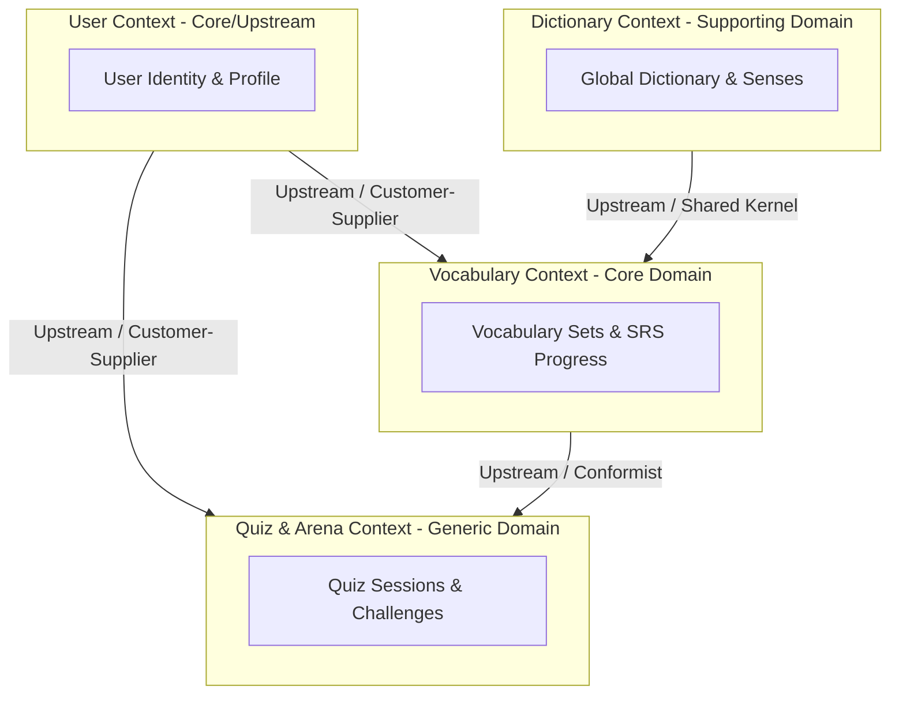

# 🗺️ Bounded Contexts Mapping (DDD)

Bản đồ phân rã các miền nghiệp vụ của hệ thống **SparkNestEd** theo phương pháp thiết kế hướng miền chi tiết (**Domain-Driven Design - DDD**). 

Hệ thống được chia tách thành các Bounded Contexts độc lập để đảm bảo tính đóng gói nghiệp vụ cực kỳ cao, giảm thiểu ghép nối (loose coupling) và cho phép các nhóm phát triển có thể mở rộng độc lập.

---

## 📊 1. Bản Đồ Giao Tiếp Giữa Các Bounded Contexts

Dưới đây là sơ đồ biểu diễn các Bounded Contexts và các mối quan hệ giao tiếp nghiệp vụ/kỹ thuật giữa chúng:



---

## 🏛️ 2. Định Nghĩa Ranh Giới & Trách Nhiệm Từng Context

### 1. User Context (Upstream)
*   **Trách nhiệm:** Quản lý tài khoản, thông tin định danh (User Profile), xác thực JWT, phân quyền hệ thống (RBAC/ABAC).
*   **Quan hệ:** Đóng vai trò **Upstream** (Cung cấp định danh). Khi có thay đổi về thông tin User, nó sẽ phát đi sự kiện toàn hệ thống.

### 2. Vocabulary Context (Core Domain - Trái tim hệ thống)
*   **Trách nhiệm:** Quản lý toàn bộ tiến trình học tập, tạo gói từ vựng, tính toán thuật toán Spaced Repetition (SM-2), lưu trữ tiến trình cá nhân hóa.
*   **Quan hệ:** 
    *   Là **Customer** của `User Context`: Nhận `userId` dạng chuỗi để liên kết tiến trình học, không lưu trực tiếp thông tin cá nhân của user.
    *   Chia sẻ **Shared Kernel** với `Dictionary Context` để lấy thông tin từ vựng gốc.

### 3. Dictionary Context (Supporting Domain)
*   **Trách nhiệm:** Cung cấp kho dữ liệu từ vựng khổng lồ của hệ thống (IPA, Nghĩa của từ, tệp phát âm, ví dụ mẫu). Hỗ trợ cơ chế tự động điền thông tin khi người học tạo từ vựng mới.
*   **Quan hệ:** Cung cấp dữ liệu tĩnh chuẩn hóa cho toàn bộ hệ thống.

### 4. Quiz & Arena Context (Generic Domain)
*   **Trách nhiệm:** Sinh các câu hỏi trắc nghiệm tự động, quản lý các phiên thi đấu (Multiplayer Challenges) thời gian thực và bảng xếp hạng (Leaderboards).
*   **Quan hệ:** Là **Conformist** đối với `Vocabulary Context`: Nhận các gói từ vựng và tiến trình để sinh bộ câu hỏi tương thích với trình độ của người học.

---

## 🔌 3. Cơ Chế Tích Hợp & Giao Tiếp Dữ Liệu

Để bảo vệ ranh giới an toàn giữa các Context, hệ thống áp dụng hai mô hình giao tiếp chính:

```text
                                 [GIAO TIẾP DỮ LIỆU]
                                          │
                  ┌───────────────────────┴───────────────────────┐
                  ▼                                               ▼
     [Đồng bộ: REST/gRPC Queries]                    [Bất đồng bộ: Event Bus]
     - Chỉ dùng cho đọc dữ liệu (Read)               - Dùng cho các luồng Ghi (Write)
     - Nhẹ, nhanh, không đổi trạng thái              - Saga hoàn tác, nhất quán cuối
```

### 1. Đồng Bộ: REST/gRPC Queries (Read Pipeline)
*   **Quy tắc:** Khi một Context cần truy vấn nhanh thông tin tham chiếu từ Context khác (ví dụ: `Vocabulary Context` cần hiển thị tên User tạo gói từ vựng).
*   **Thực thi:** Gọi API gRPC nội bộ hoặc REST API nhanh có cache. **Cấm tuyệt đối việc join trực tiếp bảng SQL hoặc truy vấn chéo cơ sở dữ liệu.**

### 2. Bất Đồng Bộ: Event-Driven Architecture (Write Pipeline)
*   **Quy tắc:** Khi có các hành động làm thay đổi trạng thái liên Context (ví dụ: User xóa tài khoản ở `User Context` ➡️ cần xóa sạch các tiến trình học tập ở `Vocabulary Context` và lịch sử làm bài ở `Quiz Context`).
*   **Thực thi:**
    1.  `User Context` phát sự kiện `'user.deleted'` kèm Payload `{ userId: "..." }` lên Message Broker (RabbitMQ/BullMQ).
    2.  `Vocabulary Context` lắng nghe (Subscribe) sự kiện này và tự khởi chạy một luồng xử lý chạy ngầm để dọn dẹp dữ liệu của user tương ứng một cách an toàn.
    3.  Đảm bảo tính chất **Nhất quán cuối (Eventual Consistency)** mà không làm nghẽn luồng xử lý chính của người dùng.
