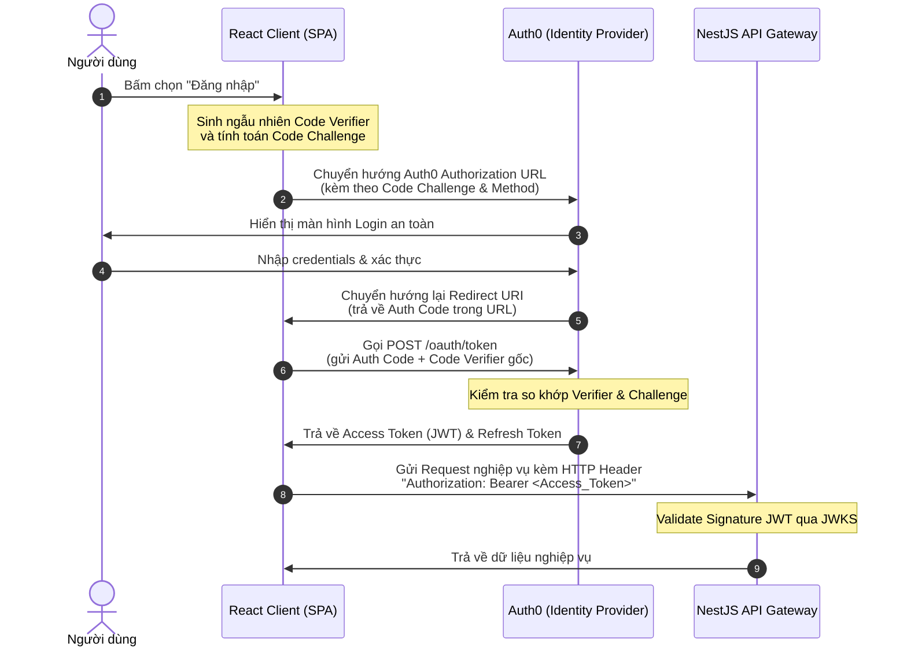

# 🔐 Identity & Access Management (IAM)

Kiến trúc quản lý định danh, xác thực và bảo mật phiên truy cập của toàn bộ người học tại hệ sinh thái **SparkNestEd**. Chúng tôi áp dụng triệt để mô hình bảo mật **Zero-Trust** và tiêu chuẩn **OAuth 2.0 / OpenID Connect (OIDC)** để bảo vệ an toàn tối đa cho hệ thống.

---

## 📊 1. Luồng Xác Thực Auth0 OIDC (PKCE Flow)

Đối với các ứng dụng Client (React Single Page App), chúng tôi bắt buộc áp dụng luồng xác thực **Authorization Code Flow kết hợp PKCE (Proof Key for Code Exchange)** để triệt tiêu nguy cơ bị đánh cắp mã xác thực (Auth Code) trên môi trường browser:

---

## 🛡️ 2. Đường Ống Xác Thực Chữ Ký JWT (JWT Validation Pipeline)

Khi tiếp nhận một request từ Client gửi lên, tầng API Gateway (hoặc NestJS JWT Guard) bắt buộc phải thực thi bộ quy trình kiểm soát tính toàn vẹn của Access Token theo đúng đường ống nghiêm ngặt:

1.  **Kiểm tra thuật toán (Algorithm Whitelisting):** Chỉ chấp nhận thuật toán ký bất đối xứng mã hóa cực mạnh **`RS256`** (cấm tuyệt đối thuật toán đối xứng `HS256` hoặc chấp nhận `none`).
2.  **Lấy Khóa Công Khai Động (JWKS - JSON Web Key Set):** Hệ thống không lưu khóa cứng (hardcode key). Bắt buộc phải tải danh sách khóa công khai động từ `https://[domain].auth0.com/.well-known/jwks.json` và lưu vào bộ nhớ cache để đối chiếu chữ ký.
3.  **Validate các trường bắt buộc (Claims Check):**
    *   **`iss` (Issuer):** Phải khớp chính xác địa chỉ Auth0 Domain của dự án.
    *   **`aud` (Audience):** Phải khớp mã ID của hệ thống API backend đăng ký.
    *   **`exp` (Expiration Time):** Mốc thời gian hiện tại bắt buộc phải nằm trước thời điểm token hết hạn.

---

## 🔒 3. Chính Sách Xoay Vòng Phiên Đăng Nhập (Token Rotation)

Để duy trì trạng thái đăng nhập mượt mà cho người học mà không bắt buộc họ phải đăng nhập lại liên tục, đồng thời giữ an toàn trước các cuộc tấn công chiếm đoạt phiên:

*   **Tuổi thọ Access Token cực ngắn:** Access Token (JWT) chỉ được cấp thời gian sống tối đa **`15 phút`**.
*   **Refresh Token Rotation:** 
    *   Sử dụng cơ chế xoay vòng Refresh Token. Mỗi khi Client gọi API gửi Refresh Token cũ lên để lấy Access Token mới, Auth0 sẽ lập tức thu hồi Refresh Token cũ đó và trả về **một Refresh Token mới hoàn toàn**.
    *   Nếu một kẻ tấn công cố tình sử dụng lại một Refresh Token cũ đã bị thu hồi ➡️ Hệ thống lập tức nhận diện và **thu hồi ngay lập tức toàn bộ các token hiện có** thuộc phiên đó, bắt buộc toàn bộ phiên phải đăng nhập lại từ đầu để bảo mật.
*   **Secure Cookies:** Refresh Token bắt buộc được thiết lập và ghi nhận hoàn toàn dưới dạng **HttpOnly Secure Cookie** có cờ `SameSite=Strict` để triệt tiêu hoàn toàn khả năng bị đánh cắp qua mã độc javascript (XSS) hoặc tấn công giả mạo (CSRF).
