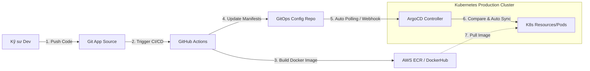

# ☁️ GitOps & ArgoCD Deployment

Tài liệu quy định tiêu chuẩn tự động hóa triển khai sản phẩm ứng dụng (Continuous Deployment) theo mô hình **GitOps** hiện đại, sử dụng **ArgoCD** trên cụm **Kubernetes (K8s)** của hệ sinh thái **SparkNestEd**.

---

## 📊 1. Sơ Đồ Quy Trình Vận Hành GitOps

Hệ thống áp dụng mô hình khai báo hạ tầng dưới dạng mã nguồn (**Infrastructure as Code**). Trạng thái thực tế trên cụm Kubernetes luôn được đồng bộ khớp chính xác với cấu hình lưu giữ tại Git Repository:



---

## 🔌 2. Tệp Cấu Hình Thực Tế Của ArgoCD Application

Dưới đây là tệp tin cấu hình khai báo tiêu chuẩn để ArgoCD tự động quản lý và đồng bộ một dịch vụ con (`vocabulary-service`):

```yaml
# packages/backend/infrastructure/k8s/argocd-vocabulary-app.yaml
apiVersion: argoproj.io/v1alpha1
kind: Application
metadata:
  name: sparknested-vocabulary-service
  namespace: argocd
  finalizers:
    - resources-finalizer.argocd.argoproj.io
spec:
  project: default
  source:
    repoURL: 'https://github.com/spark-nest-ed/gitops-infrastructure.git'
    targetRevision: HEAD
    path: helm-charts/vocabulary-service
    helm:
      valueFiles:
        - values-prod.yaml
  destination:
    server: 'https://kubernetes.default.svc'
    namespace: sparknested-production
  syncPolicy:
    automated:
      prune: true      // Tự động xóa bỏ tài nguyên K8s cũ khi Git cấu hình xóa đi
      selfHeal: true   // Tự sửa chữa: Đè lại cấu hình chuẩn nếu ai đó sửa bằng tay trên K8s
    syncOptions:
      - CreateNamespace=true
```

---

## 🔄 3. Chiến Lược Triển Khai Canary (Argo Rollouts)

Đối với các bản cập nhật tính năng nghiệp vụ thông thường, để giảm thiểu tối đa rủi ro, chúng tôi sử dụng **Argo Rollouts** để điều phối tiến trình nâng cấp dạng **Canary**:

### Quy trình phân cắt và tăng tỷ lệ traffic tự động:
1.  **Giai đoạn 1 (5% Traffic):** Tải phiên bản mới song song và điều hướng đúng 5% lượng người dùng thực tế sang. Duy trì trong **1 giờ** để theo dõi log.
2.  **Giai đoạn 2 (20% Traffic):** Nếu không phát sinh lỗi nghiêm trọng, tự động nâng tỷ lệ lên 20%. Duy trì trong **4 giờ**.
3.  **Giai đoạn 3 (100% Traffic):** Hoàn tất di chuyển toàn bộ người dùng sang phiên bản mới. Giải phóng tài nguyên K8s cũ.

### Cơ chế Tự động Hoàn Tác (Automated Rollback):
Trong suốt tiến trình nâng cấp Canary, hệ thống Prometheus sẽ liên tục chạy truy vấn giám sát tỷ lệ lỗi 5xx. Nếu chỉ số **`http_error_rate > 1%`** liên tục trong 2 phút ➡️ Argo Rollouts lập tức dừng tiến trình nâng cấp, ngắt ngay 5% traffic kia và **tự động hoàn tác (Rollback) 100% về phiên bản cũ an toàn** trong vòng dưới 10 giây mà không cần sự can thiệp của con người.

---

## 🏛️ 4. Quy Quy Trình Triển Khai Blue-Green (Zero-Downtime SOP)

Đối với các bản phát hành đặc biệt quan trọng có cập nhật lớn về cơ sở dữ liệu hoặc cấu trúc lõi hệ thống:

```text
  [BLUE ENVIRONMENT (Active)]  ◀─── [Traffic Router] ───▶  [GREEN ENVIRONMENT (Idle)]
  - Đang phục vụ 100% người dùng.                           - Deploy phiên bản mới lên đây.
                                                            - Chạy các bài Smoke Tests độc lập.
                                                                                │
  [Traffic Cut-over (Hoán đổi tức thì)] ◀───────────────────────────────────────┘
  - Đổi DNS / Ingress Routing sang Green.
  - Theo dõi tỷ lệ lỗi. Lỗi ➡️ Hủy Ingress đổi ngược lại Blue trong 1 giây (Rollback).
```

1.  **Duy trì song song hai cụm:** Giữ cụm **Blue** hoạt động phục vụ người học. Triển khai cụm **Green** chạy độc lập phiên bản mới hoàn toàn.
2.  **Smoke Testing (Kiểm tra khói):** Đội ngũ QA thực thi các bài kiểm thử tự động API Gateway nhắm thẳng vào cụm Green để xác nhận hệ thống mới hoàn hảo.
3.  **Hoán đổi Ingress Routing:** Cấu hình bộ điều hướng (AWS Route53 hoặc Cloudflare Load Balancer) hoán đổi DNS trỏ từ cụm Blue sang cụm Green tức thì trong 1 giây.
4.  **Hạ hạ tầng cũ:** Giữ cụm Blue chạy không tải trong 1 giờ để đề phòng khẩn cấp cần rollback, sau đó tiến hành tắt hạ tầng cũ để tiết kiệm tài nguyên.
